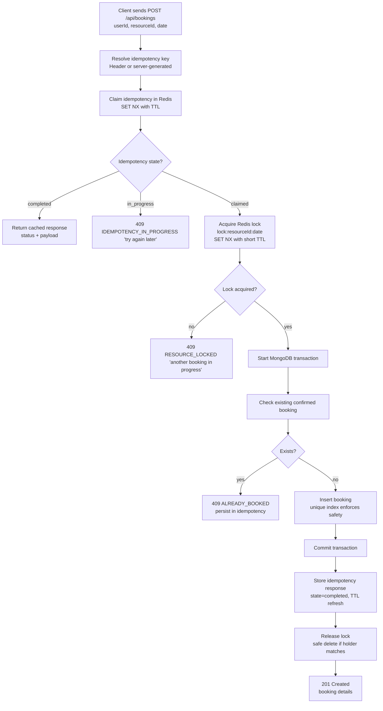

# Booking Idempotency Demo

This project demonstrates a real-world booking flow with a Node.js + Express +
MongoDB backend, Redis for distributed locks/idempotency, and a React frontend.
It focuses on correctness under retries and concurrent requests. You can run it
locally or deploy the full stack to Kubernetes (see [Run the app](#run-the-app)).

## Backend Flow (End-to-End)

1. **Idempotency key selection (Redis)**
   - If the client sends `Idempotency-Key`, the server uses it.
   - If missing, the server generates a deterministic key from
     `userId + resourceId + date` with a short TTL.

2. **Idempotency claim (outside the transaction, Redis)**
   - The server inserts an `in_progress` record for the key.
   - If a record already exists and is `completed`, the cached response is
     returned immediately.
   - If a record exists and is `in_progress`, the request is rejected with
     `409 IDEMPOTENCY_IN_PROGRESS`.

3. **Lock acquisition (outside the transaction, Redis)**
   - A resource+date lock is created with a short TTL.
   - If another active lock exists, the request returns
     `409 RESOURCE_LOCKED`.

4. **Transactional booking**
   - The server checks for an existing confirmed booking.
   - A unique partial index on `{ resourceId, date }` for `status=confirmed`
     ensures no duplicates even if locking fails.
   - The booking is created inside a MongoDB transaction.

5. **Finalize idempotency**
   - The idempotency record is updated to `completed` with the response payload.
   - The lock is released.


## How This Work


- For a detailed overview of the entire flow, see [SequenceDiagram.md](./SequenceDiagram.md).
- An animated visualization of this flow is available at: [SequenceDiagram Flow](https://storage.googleapis.com/idempotency-demo-animation/index.html)


## Why this is safe

- **Concurrent same-key requests**: only the first request owns the key; others
  get `IDEMPOTENCY_IN_PROGRESS` or the cached response if it completed.
- **Concurrent different-key requests**: the lock + unique index ensures only
  one confirmed booking exists for a resource/date.
- **Retries after network glitches**: server-generated idempotency keys return
  the original success response for the same payload.

## Test Coverage

- Idempotency returns the same response for the same key.
- Idempotency ignores payload changes with the same key.
- Server-generated idempotency keys are reused for repeated payloads.
- Concurrent requests (same key / different key) never create duplicates.

Run tests (requires Redis running locally):

```
cd backend
npm install
npm test
```

## Run the app

### Local development

Backend (requires Redis and MongoDB running locally, e.g. default `root`/`example` and port 27017):

```
cd backend
npm install
npm run dev
```

Frontend:

```
cd frontend
npm install
npm start
```

### Kubernetes deployment

The app can run fully in-cluster with MongoDB (StatefulSet), Redis (StatefulSet), backend (Deployment), frontend (Deployment), and an Ingress.

**Prerequisites:** a running cluster (e.g. minikube, kind, Rancher Desktop), `kubectl`, and Docker (if you build images locally).

1. **Build and load images** (when using a local cluster that doesn’t pull from a registry):

   ```bash
   docker build -t backend:latest ./backend
   docker build -t frontend:latest ./frontend
   # Load into cluster (example for kind):
   kind load docker-image backend:latest frontend:latest
   ```

2. **MongoDB keyfile** (required for replica set auth). From repo root:

   ```bash
   ./k8s/mongodb/generate-keyfile-secret.sh   # creates/updates k8s/mongodb/keyfile-secret.yaml
   ```

3. **Apply all resources** (namespace `bookingapp`, MongoDB, Redis, backend, frontend, ingress):

   ```bash
   kubectl apply -k k8s/
   ```

4. **Reach the app:** Ingress is configured for host `bookingapp.local`. Add to `/etc/hosts` (or equivalent):

   ```
   127.0.0.1 bookingapp.local
   ```

   Then open http://bookingapp.local (frontend) and http://bookingapp.local/api/health (backend).  
   API base URL for the frontend: `http://bookingapp.local/api`.

5. **Day-to-day ops** (logs, restart, Mongo shell, etc.) are in [k8s/readme.md](k8s/readme.md).

