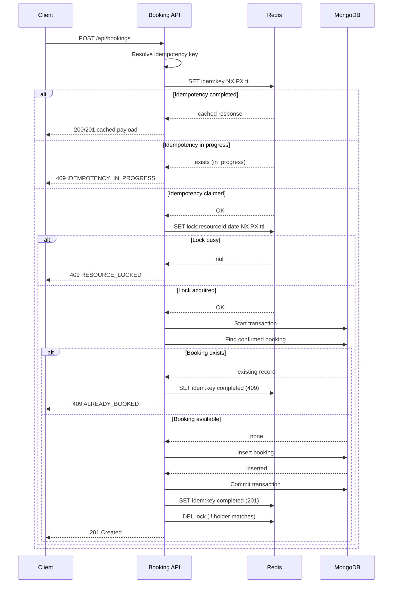

```mermaid
sequenceDiagram
  participant Client
  participant API as Booking API
  participant Redis
  participant Mongo as MongoDB

  Client->>API: POST /api/bookings
  API->>API: Resolve idempotency key
  API->>Redis: SET idem:key NX PX ttl
  alt Idempotency completed
    Redis-->>API: cached response
    API-->>Client: 200/201 cached payload
  else Idempotency in progress
    Redis-->>API: exists (in_progress)
    API-->>Client: 409 IDEMPOTENCY_IN_PROGRESS
  else Idempotency claimed
    Redis-->>API: OK
    API->>Redis: SET lock:resourceId:date NX PX ttl
    alt Lock busy
      Redis-->>API: null
      API-->>Client: 409 RESOURCE_LOCKED
    else Lock acquired
      Redis-->>API: OK
      API->>Mongo: Start transaction
      API->>Mongo: Find confirmed booking
      alt Booking exists
        Mongo-->>API: existing record
        API->>Redis: SET idem:key completed (409)
        API-->>Client: 409 ALREADY_BOOKED
      else Booking available
        Mongo-->>API: none
        API->>Mongo: Insert booking
        Mongo-->>API: inserted
        API->>Mongo: Commit transaction
        API->>Redis: SET idem:key completed (201)
        API->>Redis: DEL lock (if holder matches)
        API-->>Client: 201 Created
      end
    end
  end
```
